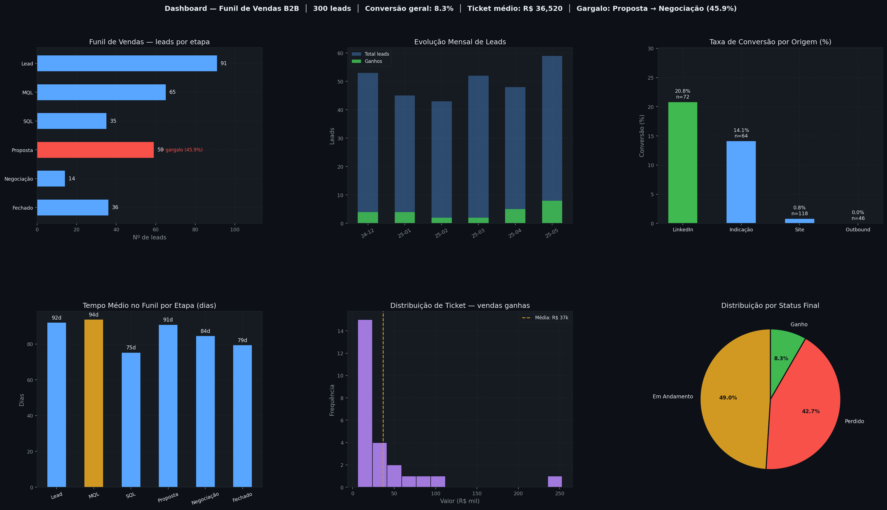

# Análise Automatizada de Funil de Vendas B2B

Sistema em Python que gera dados fictícios de leads, calcula indicadores de desempenho
comercial e produz um dashboard visual e um relatório executivo — do zero ao diagnóstico
acionável em um único comando.

É o tipo de análise que um analista de dados ou de processos faz recorrentemente em
empresas B2B: identificar onde o funil está vazando, qual canal converte mais e quanto
tempo os leads ficam parados em cada etapa.



---

## Como executar

```bash
git clone https://github.com/ThiagoPv123/funil-vendas-b2b
cd funil-vendas-b2b
pip install -r requirements.txt
python src/main.py
```

Em segundos os quatro arquivos de saída são gerados ou atualizados.

> **Windows:** se encontrar erro de encoding, use `python -X utf8 src/main.py`

---

## O que o sistema produz

| Arquivo | Descrição |
|---|---|
| `data/leads_brutos.csv` | 300 leads fictícios com origem, etapa, valor e status |
| `data/leads_processados.csv` | Dados limpos com campos derivados (dias no funil, tempo de ciclo) |
| `outputs/dashboard.png` | 6 gráficos: funil, evolução mensal, conversão por canal, tempo por etapa, distribuição de ticket e status final |
| `outputs/relatorio_executivo.md` | Diagnóstico em texto: visão geral, gargalo identificado e recomendações |

---

## Os 7 indicadores calculados

1. **Taxa de conversão por etapa** — onde o funil está vazando
2. **Taxa de conversão geral** — do total de leads, quantos viraram clientes
3. **Tempo médio de ciclo** — dias médios de entrada até fechamento (ganhos)
4. **Ticket médio** — valor médio das vendas fechadas
5. **Conversão por canal de origem** — qual canal traz leads que mais convertem
6. **Gargalo do funil** — etapa com maior perda percentual de leads
7. **Evolução mensal** — tendência de volume e conversão ao longo do tempo

---

## Estrutura

```
funil-vendas-b2b/
├── src/
│   ├── gerar_dados.py    <- gera 300 leads fictícios com distribuição realista
│   ├── processar.py      <- limpa e calcula campos derivados
│   ├── analisar.py       <- calcula os 7 indicadores
│   ├── dashboard.py      <- gera o PNG com 6 gráficos (tema dark)
│   ├── relatorio.py      <- gera o relatório executivo em Markdown
│   └── main.py           <- orquestra tudo
├── data/                 <- CSVs (gerados ao rodar)
├── outputs/              <- dashboard.png e relatorio_executivo.md
└── requirements.txt
```

---

## Stack

Python · Pandas · NumPy · Matplotlib
